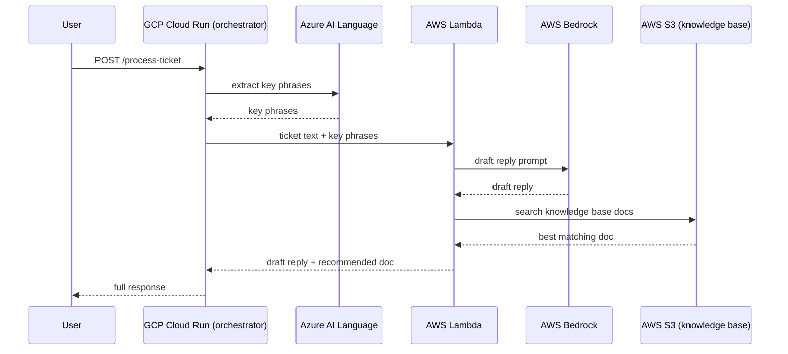

# Multi-Cloud AI Support Agent

An AI agent that reads a support ticket, extracts key topics, drafts a reply,
and recommends a knowledge-base article — orchestrated across three clouds:

- **Azure** — AI Language service extracts key phrases from the raw ticket (NLP)
- **AWS** — Lambda calls **Amazon Bedrock** (Claude 3 Haiku) to draft the reply,
  and searches a knowledge base stored in **S3**
- **GCP** — **Cloud Run** hosts the orchestrator that calls both, backed by
  **Artifact Registry** for the container image

That's 6 managed services across 3 providers, provisioned with **Terraform**
and deployed by a **GitHub Actions** pipeline — you never run a cloud CLI
command yourself; you fill in secrets on GitHub's website and watch the
Actions tab do the work.



---

## Before you start: costs and scope

- Everything here fits comfortably in free-tier / free-credit limits for a
  weekend project **if you tear it down afterward** (see Step 7). Bedrock and
  Lambda are pay-per-invocation and cost fractions of a cent for testing.
- The Lambda Function URL and Cloud Run service are set to allow
  unauthenticated calls, for demo simplicity. Don't leave this running
  long-term or put real customer data through it — see "Hardening" at the
  bottom.
- Amazon Bedrock model access has to be manually enabled per-model in the AWS
  Console before Terraform can use it (Step 2).

---

## Step 1 — Get your three sets of cloud credentials (GUI only)

Terraform and GitHub Actions need programmatic credentials for each cloud.
You create these once, through each console's UI, then paste them into
GitHub as repository secrets — you never type them into a terminal.

### Azure
1. Go to **portal.azure.com** → search **"App registrations"** → **New registration**.
   Name it `ai-agent-deploy`, click Register.
2. On the app's Overview page, copy the **Application (client) ID** and
   **Directory (tenant) ID**.
3. Go to **Certificates & secrets** → **New client secret** → copy the
   **Value** immediately (shown once).
4. Go to **Subscriptions** in the search bar → copy your **Subscription ID**.
5. Go to your subscription → **Access control (IAM)** → **Add role
   assignment** → role **Contributor** → assign to the app you just created
   (`ai-agent-deploy`).

### AWS
1. Go to **console.aws.amazon.com/iam** → **Users** → **Create user**, name
   it `ai-agent-deploy`.
2. Attach policies: `AmazonS3FullAccess`, `AWSLambda_FullAccess`,
   `IAMFullAccess`, `AmazonBedrockFullAccess` (for a resume demo this is
   fine; scope it down for anything real).
3. Create the user, then go to **Security credentials** tab → **Create
   access key** → choose "Application running outside AWS" → copy the
   **Access key ID** and **Secret access key**.
4. **Enable the Bedrock model:** go to **Amazon Bedrock console** →
   **Model access** (left sidebar) → **Modify model access** → enable
   **Anthropic Claude 3 Haiku** → Save. This step is manual and can't be
   done by Terraform — Bedrock requires an explicit access grant per model.

### GCP
1. Go to **console.cloud.google.com** → create a new project (or use an
   existing one) → note the **Project ID** (not the display name).
2. Go to **IAM & Admin → Service Accounts** → **Create service account**,
   name it `ai-agent-deploy`.
3. Grant it roles: **Editor** (simplest for a demo; you can scope down to
   Cloud Run Admin, Artifact Registry Admin, Service Account User for
   production).
4. Click the service account → **Keys** tab → **Add key → Create new key →
   JSON** → this downloads a `.json` file. Keep it safe.

---

## Step 2 — Add secrets to your GitHub repo (GUI only)

Push this project to a new GitHub repo, then go to
**Settings → Secrets and variables → Actions → New repository secret** and
add each of these one at a time:

| Secret name | Value |
|---|---|
| `ARM_CLIENT_ID` | Azure app's Application (client) ID |
| `ARM_CLIENT_SECRET` | Azure app's client secret value |
| `ARM_TENANT_ID` | Azure Directory (tenant) ID |
| `AZURE_SUBSCRIPTION_ID` | Azure subscription ID |
| `AWS_ACCESS_KEY_ID` | AWS access key ID |
| `AWS_SECRET_ACCESS_KEY` | AWS secret access key |
| `S3_BUCKET_NAME` | A globally-unique name, e.g. `ai-agent-kb-yourname-2026` |
| `GCP_PROJECT_ID` | GCP project ID |
| `GCP_SA_KEY` | The **entire contents** of the downloaded GCP JSON key file |

---

## Step 3 — Push and watch it deploy

```
git add .
git commit -m "Initial multi-cloud AI agent"
git push origin main
```

Go to your repo's **Actions** tab. The `Deploy Multi-Cloud AI Agent` workflow
starts automatically. Click into it to watch each step run live — this is
your CLI-free view into Terraform applying across all three clouds, the
Docker image building, and Cloud Run deploying. A full run takes 3-6 minutes.

---

## Step 4 — Verify resources in each console

- **Azure Portal** → Resource groups → `rg-ai-agent-demo` → you should see a
  Cognitive Services (Language) resource.
- **AWS Console** → S3 → your bucket with 3 JSON files; Lambda →
  `ai-agent-draft-reply` function.
- **GCP Console** → Cloud Run → `ai-agent-orchestrator` service, with a
  public URL; Artifact Registry → `ai-agent-repo` with your image.

---

## Step 5 — Test it

Copy the Cloud Run URL from the GCP Console (Cloud Run → your service →
top of the page). You can test it without any CLI using a tool like
**Postman**, **Insomnia**, or even your browser's dev tools console with
`fetch()`:

```javascript
fetch("https://YOUR-CLOUD-RUN-URL/process-ticket", {
  method: "POST",
  headers: { "Content-Type": "application/json" },
  body: JSON.stringify({
    subject: "Can't log in to my account",
    body: "I reset my password twice but it still says invalid credentials."
  })
}).then(r => r.json()).then(console.log)
```

Expected response shape:
```json
{
  "key_phrases": ["password", "account", "credentials"],
  "draft_reply": "Hi, thanks for reaching out...",
  "recommended_doc": {
    "title": "How to Reset Your Password",
    "url": "https://example.com/help/password-reset"
  }
}
```

---

## Step 6 — What to say about it on your resume

> Built a multi-cloud AI agent orchestration system spanning Azure, AWS, and
> GCP — an NLP service extracts context from support tickets, an AWS
> Bedrock-backed Lambda drafts LLM replies and searches a knowledge base,
> and a GCP Cloud Run service orchestrates the pipeline end-to-end.
> Infrastructure fully defined as code with Terraform across all three
> providers; deployed via a GitHub Actions CI/CD pipeline with zero manual
> provisioning steps.

That's a genuinely strong, specific bullet — it shows IaC, CI/CD, distributed
systems design, and real LLM integration, not just "called an API."

---

## Step 7 — Tear it down (do this — avoid surprise charges)

This is the step people skip and regret. Once you've taken your screenshots
and tested the endpoint:

1. In GitHub, temporarily disable the workflow (Actions tab → workflow →
   "..." → Disable workflow) so it doesn't reapply anything.
2. You need `terraform destroy` to run once to clean up. Since this repo has
   no CLI steps, the simplest GUI-safe path is: manually delete resources
   from each console — the Azure resource group (deletes everything inside
   it in one action), the AWS Lambda function + S3 bucket, and the GCP
   Cloud Run service + Artifact Registry repo. Deleting a resource group /
   equivalent top-level container in each console is fast and thorough.
3. Double check AWS Bedrock — it has no idle cost, but confirm no other
   Lambda/API Gateway resources were left behind.

---

## Hardening notes (skip for the resume demo, mention if asked in interviews)

- Lock down the Lambda Function URL and Cloud Run service to require
  authentication instead of `allUsers`/`NONE`.
- Move the Terraform state to a remote backend (e.g. an S3 bucket with
  DynamoDB locking) instead of local state inside the CI runner.
- Move the Azure key into GCP Secret Manager instead of passing it as a
  plain Cloud Run env var.
- Scope the AWS/GCP/Azure deploy identities down from broad admin policies
  to least-privilege roles.
